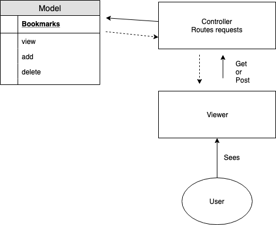

# Bookmark Manager Challenge (Week 4)

## User story:
### First story:
`As a user,`
`So that I can quickly revisit my favourite websites,`
`I want to see list of bookmarks`

### Second story:
`As a user`
`So that I can store new bookmarks`
`I want to be able to add new bookmarks to my list`

### Third story:
`As a user`
`So that I can delete bookmarks I no longer need`
`I want to be able to delete bookmarks from my list`

## Domain model:

## How to use:
### To create database:
1. Connect to psql
2. Create the database using the `psql` command `CREATE DATABASE bookmark_manager`;
3. Connect to the database using the `pqsl` command `\c bookmark_manager`;
4. Run the query we have saved in the file `01_create_bookmarks_table.sql`

### To create test database:
1. `$> psql`
2. `<username>=# CREATE DATABASE "bookmark_manager_test";`
3. `\c bookmark_manager_test`
4. `<username>=# CREATE TABLE bookmarks(id SERIAL PRIMARY KEY, url VARCHAR(60));`
